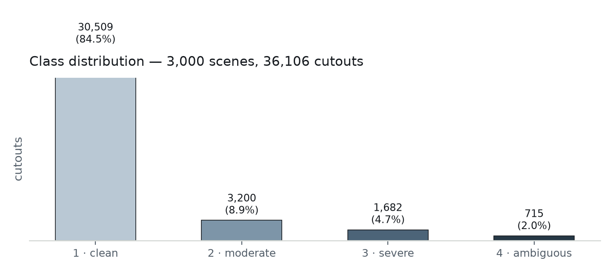
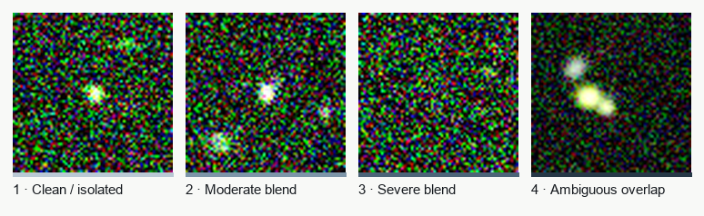
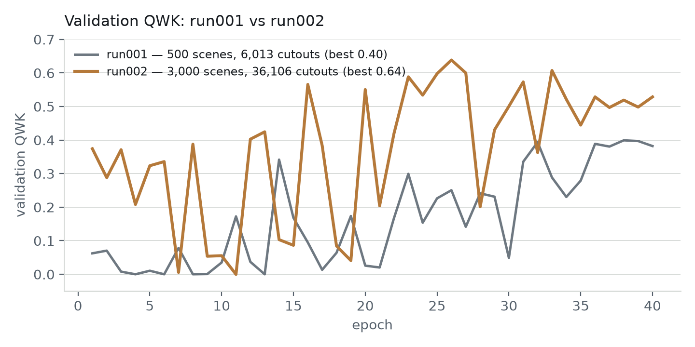
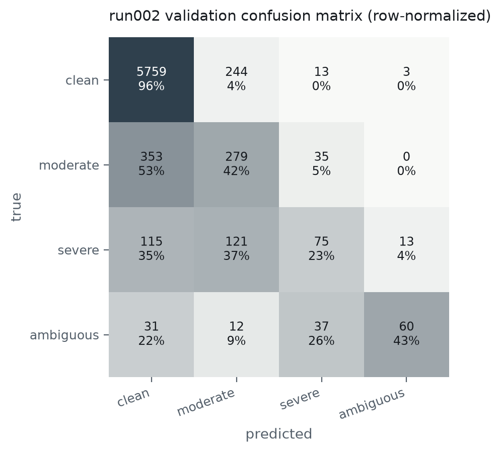
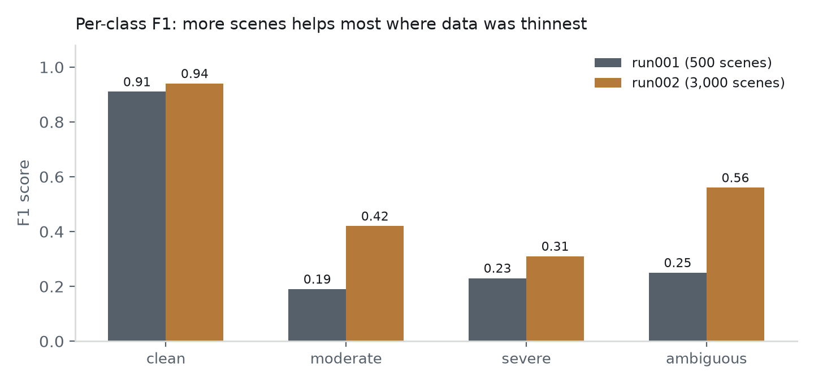

## 1. Summary

run001 (500 scenes) reached QWK 0.40, with the model reliably separating clean from
ambiguous but frequently confusing the moderate and severe middle classes — plausibly
because those classes had only ~300–500 training examples each. This report covers
**run002**: the same pipeline and model, run on **3,000 scenes** (6x more), to test
that hypothesis directly.

**Result: QWK rose from 0.40 to 0.64**, and the improvement is concentrated exactly
where predicted — the moderate and ambiguous classes, which had the least data before.

## 2. The data

3,000 scenes produced 36,106 cutouts, roughly 6x run001's 6,013:

| class | run001 (500 scenes) | run002 (3,000 scenes) | growth |
|---|---|---|---|
| clean | 5,105 | 30,509 | 6.0x |
| moderate | 485 | 3,200 | 6.6x |
| severe | 307 | 1,682 | 5.5x |
| ambiguous | 116 | 715 | 6.2x |

{ width=95% }

{ width=95% }

## 3. Training

Same architecture, loss, and optimizer settings as run001's final (stable) attempt —
AdamW, gradient clipping, cosine LR decay, dihedral augmentation, inverse-frequency
sampling. No hyperparameter changes; the only variable is dataset size.

{ width=95% }

Training is still visibly noisy epoch-to-epoch (expected — the weighted sampler and
small rare-class counts mean each epoch sees a different draw), but the *level* it
oscillates around is now clearly higher and the best epoch reaches much further:
**QWK 0.64** vs. 0.40.

## 4. Final model evaluation

Held-out validation split: 7,150 cutouts from scenes never used in training (proportionally
larger than run001's 1,197, since the dataset itself is larger).

- **QWK: 0.64** (substantial agreement, up from 0.40 / moderate)
- **Balanced accuracy: 0.509** (up from 0.373)

{ width=70% }

```
              precision    recall  f1-score   support

       clean       0.92      0.96      0.94      6019
    moderate       0.43      0.42      0.42       667
      severe       0.47      0.23      0.31       324
   ambiguous       0.79      0.43      0.56       140

    accuracy                           0.86      7150
   macro avg       0.65      0.51      0.56      7150
weighted avg       0.85      0.86      0.85      7150
```

{ width=95% }

Every class improved, but not equally:

- **Ambiguous**: F1 0.25 -> 0.56 — more than doubled. This was the rarest class
  (116 examples) and benefited the most from 6x more data.
- **Moderate**: F1 0.19 -> 0.42 — also more than doubled.
- **Severe**: F1 0.23 -> 0.31 — improved but remains the weakest class. The
  confusion matrix shows severe is still most often mistaken for moderate (121 of 324)
  or even clean (115 of 324), suggesting this boundary is harder than data volume
  alone can fix — see §5.
- **Clean**: F1 0.91 -> 0.94 — already strong, modest further gain.

## 5. Interpretation and next steps

The core hypothesis from run001 is confirmed: **data volume was a real bottleneck**,
not just a modeling limitation, for the moderate/ambiguous classes. Doubling down on
more scenes should keep helping there.

Severe is the outlier — it improved the least relative to its 5.5x data increase, and
its confusion is spread across both neighbors (moderate and clean) rather than
concentrated at one boundary. Two hypotheses worth checking before assuming more data
alone will fix it:

- The severe/moderate and severe/clean thresholds in `labeling.py` (`moderate_max:
  0.15`, `severe_max: 0.5`) may not align well with what's visually/photometrically
  distinguishable — worth another calibration pass against thumbnails specifically in
  this range.
- Severe blends by definition span a wide continuous range of *B*; the class may
  simply be intrinsically harder to separate from its neighbors than ambiguous is from
  clean, independent of sample count.

**Concrete next steps:**

- Scale further (10,000+ scenes) — cheap to test whether severe keeps improving or
  plateaus, which would distinguish the two hypotheses above.
- Revisit the severe-class thresholds with a targeted calibration pass.
- Bring in the 43 real LSST+Euclid cutouts as the actual sim-to-real check — still not
  done as of this report.
