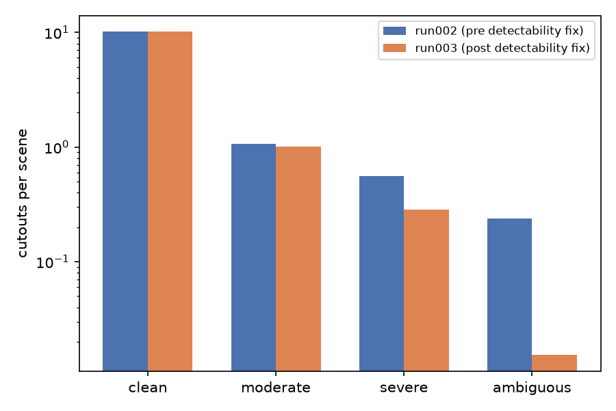
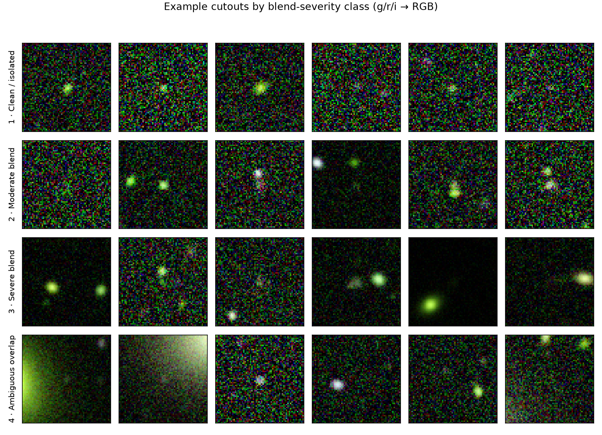
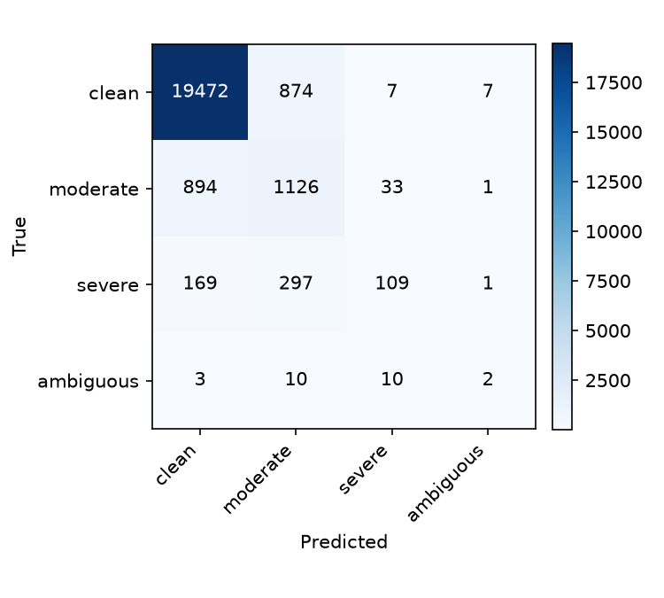
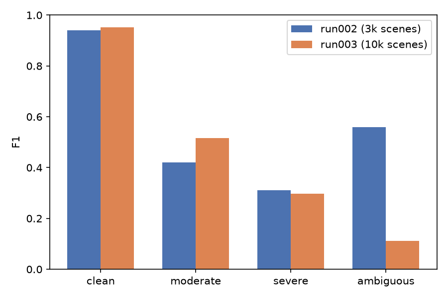

## 1. Summary

run002 (3,000 scenes) reached QWK 0.64, and its "next steps" section proposed scaling
further to test whether the weak **severe** class kept improving with more data. Before
running that, two bugs were fixed: cutout generation was OOM-killing the process at
10k-scene scale (now streams to a memmap instead of stacking in RAM), and a
local-peak-dominance detectability check was added so that a faint target fully
swamped by a bright neighbor no longer got labeled as a genuine blend.

**run003 (10,000 scenes, 114,418 cutouts) reached QWK 0.57 — down from run002's 0.64,
not up.** The regression is not a data-volume story. It's a side effect of the
detectability fix: it removed far more of the **ambiguous** class than the 20-scene
calibration test suggested, and the resulting near-vanishing rare class dragged the
aggregate metrics down even though the two big classes (clean, moderate) both improved.

## 2. The data

| class | run002 (3,000 scenes) | run003 (10,000 scenes) | per-scene rate, run002 | per-scene rate, run003 |
|---|---|---|---|---|
| clean | 30,509 | 101,341 | 10.17 | 10.13 |
| moderate | 3,200 | 10,059 | 1.07 | 1.01 |
| severe | 1,682 | 2,865 | 0.56 | 0.29 |
| ambiguous | 715 | 153 | 0.24 | 0.015 |

{ width=90% }

{ width=95% }

Clean and moderate rates are essentially unchanged scene-for-scene — the detectability
fix doesn't touch them much. But **severe roughly halved and ambiguous collapsed
~15x** on a per-scene basis. The 20-scene calibration test run before merging the fix
found only 3 of 242 nominal detections were swamped-target artifacts (~1.2%); at full
10,000-scene scale the effect turned out to be far larger, concentrated almost entirely
in the ambiguous class specifically. In absolute terms, run003 has *fewer* ambiguous
examples (153) than run002 had (715) despite 3.3x more scenes simulated.

This makes sense in hindsight: "ambiguous" is by construction the class where a target
and neighbor are hardest to tell apart, which strongly overlaps with the case the
detectability check is designed to catch (target swamped, not distinguishable as its
own peak). The fix and the ambiguous class label were pointing at overlapping
territory more than the initial calibration sample showed.

## 3. Training

Same architecture, loss, and optimizer as run001/run002 — AdamW, gradient clipping,
cosine LR decay, dihedral augmentation, inverse-frequency sampling. Held-out validation
split: 23,015 cutouts (20%, split by scene) from scenes never seen in training.

## 4. Final model evaluation

- **QWK: 0.57** (down from run002's 0.64)
- **Balanced accuracy: 0.44** (down from run002's 0.51)

{ width=65% }

```
              precision    recall  f1-score   support

       clean       0.95      0.96      0.95     20360
    moderate       0.49      0.55      0.52      2054
      severe       0.69      0.19      0.30       576
   ambiguous       0.18      0.08      0.11        25

    accuracy                           0.90     23015
   macro avg       0.58      0.44      0.47     23015
weighted avg       0.90      0.90      0.90     23015
```

{ width=90% }

- **Clean**: F1 0.94 -> 0.95. Continues to improve slightly with scale, as expected.
- **Moderate**: F1 0.42 -> 0.52. Real gain, consistent with run002's finding that this
  class was data-limited.
- **Severe**: F1 0.31 -> 0.30, effectively flat. Precision rose sharply (0.47 -> 0.69)
  but recall fell (0.23 -> 0.19) — the model became more conservative about calling
  severe rather than better at finding it. This matches run002's hypothesis that severe
  is intrinsically hard to separate from its neighbors, not simply data-starved: doubling
  its per-scene rate's *absolute* count (1,682 -> 2,865) didn't move F1.
- **Ambiguous**: F1 0.56 -> 0.11. The collapse here is the dominant driver of the
  overall QWK/balanced-accuracy drop. With only ~122 training examples after the
  80/20 split (153 total), inverse-frequency sampling oversamples the same handful of
  images heavily every epoch; despite dihedral augmentation, the model doesn't
  generalize from that few genuinely distinct examples, and val recall on the 25
  held-out ambiguous cutouts is essentially chance (2/25 correct).

## 5. Interpretation

The run002 hypothesis — "severe is intrinsically hard, not just data-starved" — holds
up: 5.5x more severe examples between run001 and run002 helped a lot; another 1.7x
between run002 and run003 did nothing. That's a real, useful negative result: further
blind scaling is unlikely to fix severe on its own.

But the headline number (QWK down) is really a story about the detectability fix
interacting badly with scale for the rarest class. That fix is very likely *correct* —
swamped-target artifacts genuinely shouldn't be labeled as ambiguous blends — but it
now leaves ambiguous critically data-starved in a way run002 never was. This is a
labeling/thresholds problem, not a training problem.

**Concrete next steps:**

- Investigate the ambiguous-class collapse directly: sample the objects that used to
  pass the detection cut before the fix and now don't, and confirm by eye that they're
  genuinely swamped-target artifacts and not a mislabeled true-ambiguous population
  being over-filtered.
- Scale scene count specifically to recover ambiguous-class volume — at run003's rate
  (0.015/scene) it would take ~50,000 scenes to reach run002's absolute ambiguous count
  (715), which is a very different cost/benefit case than the earlier "just add more
  scenes" story.
- Revisit the severe/moderate blendedness thresholds (`moderate_max: 0.15`,
  `severe_max: 0.5`) as flagged in the run002 report — severe's plateau across two
  scale-ups makes a calibration pass more urgent, not less.
- Bring in the 43 real LSST+Euclid cutouts as the sim-to-real check — still not done.
