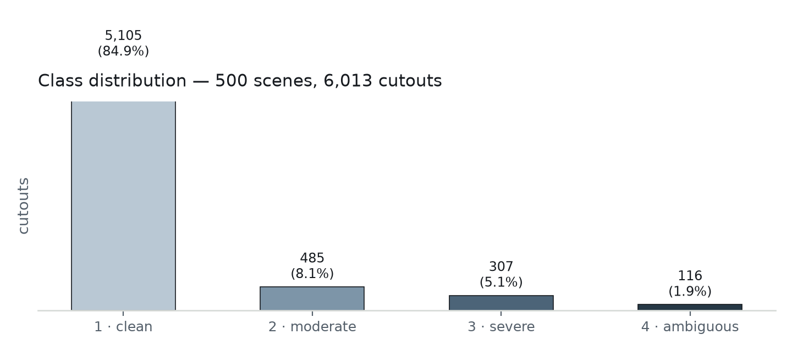
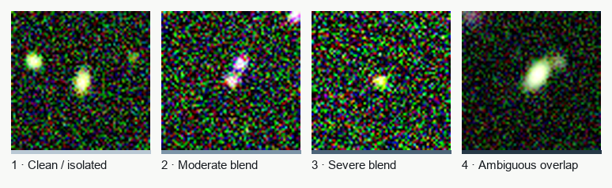
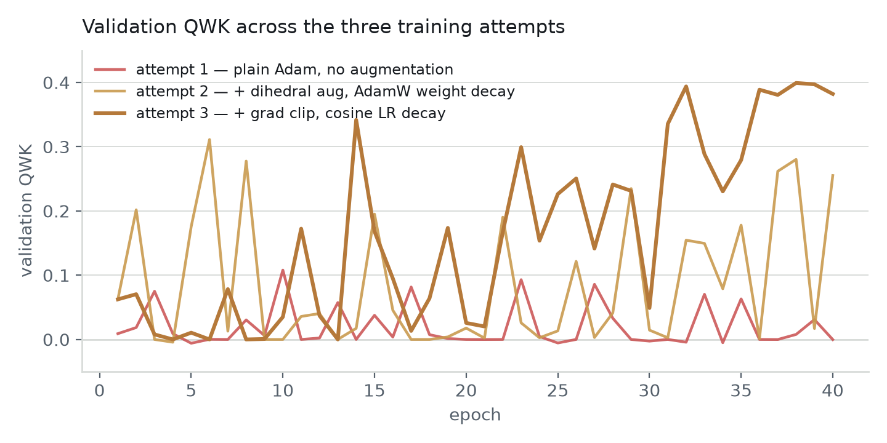
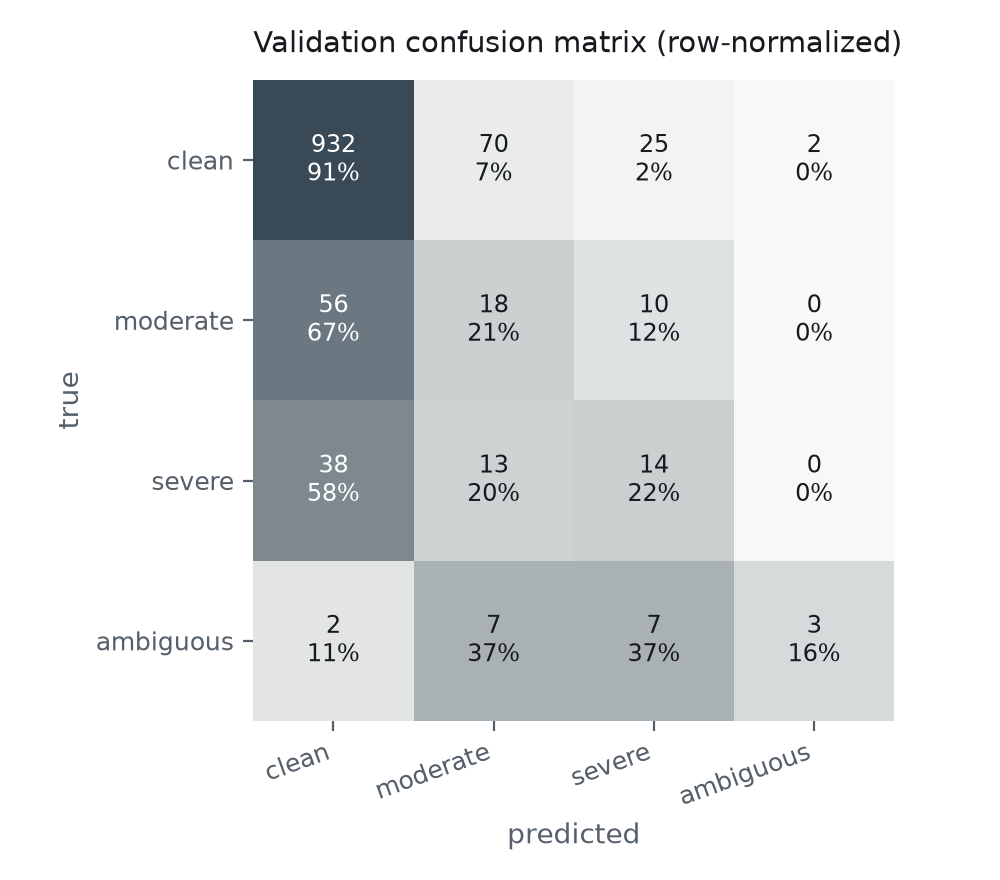

## 1. Summary

This session took the SEED_2026 pipeline from a working simulator to a first trained
model. Two things were built: the PyTorch **Dataset/DataLoader** and the **ordinal CNN +
CORN training loop**. Both were then exercised for real — first on a 242-cutout smoke
test to validate wiring, then on a proper 500-scene / 6,013-cutout run, where the first
training attempt overfit badly and was fixed in two iterations. The final model reaches
**QWK = 0.40** on a held-out validation split of scenes never seen in training.

## 2. Pipeline

| Stage | What it does | Status |
|---|---|---|
| 1. Simulate scene | GalSim + CatSim catalog render a full random field at real sky density | built prior session |
| 2. Auto-label | Truth-based blendedness *B* maps each detected object to 1 of 4 severity classes | built prior session |
| 3. Dataset / DataLoader | Loads cutouts, normalizes per band, splits by scene, weights rare classes | **built this session** |
| 4. Train | CNN backbone + CORN ordinal head, tracked with quadratic weighted kappa (QWK) | **built this session** |

## 3. The data

The full run (`data/sim/run001`) has 6,013 labeled cutouts from 500 simulated scenes.
Classes are ordinal and heavily imbalanced, which matches real sky statistics — most
galaxies are isolated.

{ width=95% }

One real example cutout per class (bands g/r/i mapped to B/G/R, arcsinh-stretched for
display):

{ width=95% }

## 4. What got built

**Dataset & normalization** (`seed_classifier/data/dataset.py`)

- Per-band arcsinh stretch, scaled by a MAD-based noise estimate — robust to the sky
  noise every cutout carries, unlike a plain log stretch.
- Split by `scene_id`, not by row: cutouts from the same scene share a noise
  realization, so row-level splitting would leak information into validation.
- Inverse-frequency `WeightedRandomSampler` so the rare severe/ambiguous classes
  aren't drowned out during training.
- Random dihedral augmentation (flip + 90° rotation) on the training split only —
  added mid-session once it became clear it was needed (see §5).

**CNN backbone** (`seed_classifier/models/cnn.py`)

| block | op | output |
|---|---|---|
| in | — | 3×64×64 |
| 1 | conv3×3 + BN + pool | 32×32×32 |
| 2 | conv3×3 + BN + pool | 64×16×16 |
| 3 | conv3×3 + BN + pool | 128×8×8 |
| 4 | conv3×3 + BN + GAP | 256×1×1 |
| head | FC 256 -> 128 -> 3 | 3 logits |

**CORN ordinal loss** (`seed_classifier/models/ordinal.py`) — 3 logits, each a
conditional binary gate *P(rank > k \| rank ≥ k)*. Chosen over CORAL because CORN's
sub-tasks are trained conditionally and don't need a shared-weight constraint to stay
rank-consistent.

**Training loop** (`seed_classifier/training/train.py`) — AdamW, gradient clipping,
cosine LR decay, quadratic weighted kappa as the headline validation metric (standard
for ordinal tasks — it penalizes a clean/ambiguous confusion far more than a
clean/moderate one), balanced accuracy tracked alongside since raw accuracy is
meaningless under this much imbalance.

## 5. Getting the first real training run to actually work

A 5-epoch smoke test on the 242-cutout set confirmed the pipeline ran end to end on
this machine's MPS backend — that only validates wiring, not model quality. The real
test was the 500-scene / 6,013-cutout run, which took three attempts:

**Attempt 1 — plain Adam, no augmentation.** Train loss collapsed to near zero within
a few epochs while validation loss repeatedly spiked to 10–40 and QWK stayed pinned
near 0. Root cause: the weighted sampler shows the ~97 unique training examples of the
rarest class roughly a dozen times per epoch, and with no augmentation those repeats
are pixel-identical — the model was simply memorizing them. Best QWK: **0.11**.

**Attempt 2 — + dihedral augmentation, AdamW weight decay.** Random flips/90° rotations
are a lossless invariance here (galaxy orientation on the sky is arbitrary), so this
directly breaks the exact-repeat memorization. QWK rose into the 0.2–0.3 range but
validation loss still spiked intermittently — a sign of the learning rate being too
high for occasional bad update steps. Best QWK: **0.31**.

**Attempt 3 — + gradient clipping, cosine LR decay.** This stabilized training
directly: the last 5 epochs hold steady at QWK 0.38–0.40 instead of swinging between 0
and 0.3. Best QWK: **0.40** (final model).

{ width=95% }

## 6. Final model evaluation

Held-out validation split: 1,197 cutouts from scenes never used in training.

- **QWK: 0.40** (moderate agreement)
- **Balanced accuracy: 0.373**

{ width=70% }

```
              precision    recall  f1-score   support

       clean       0.91      0.91      0.91      1029
    moderate       0.17      0.21      0.19        84
      severe       0.25      0.22      0.23        65
   ambiguous       0.60      0.16      0.25        19

    accuracy                           0.81      1197
   macro avg       0.48      0.37      0.39      1197
weighted avg       0.81      0.81      0.81      1197
```

Reading the confusion matrix: the model is solid on the clean class (91% recall) and
essentially never confuses clean with ambiguous (2 cases out of 1,029) — the ordinal
structure is being learned, not just a majority-class shortcut. The middle classes
(moderate, severe) are where it struggles, which is expected: they're both rarer and
sit on a continuous blendedness axis with fuzzier boundaries between them by
construction (§ thresholds in `labeling.py`).

## 7. Next steps

- **More scenes.** 500 scenes gives only ~97–116 unique examples of the rarest class
  per training split; the moderate/severe confusion is likely partly a data-volume
  problem, not just a modeling one.
- **Real LSST+Euclid validation set.** The 43 usable real cutouts haven't been touched
  yet — they're the actual sim-to-real check.
- **Revisit the moderate/severe boundary** specifically, since that's where confusion
  concentrates.
